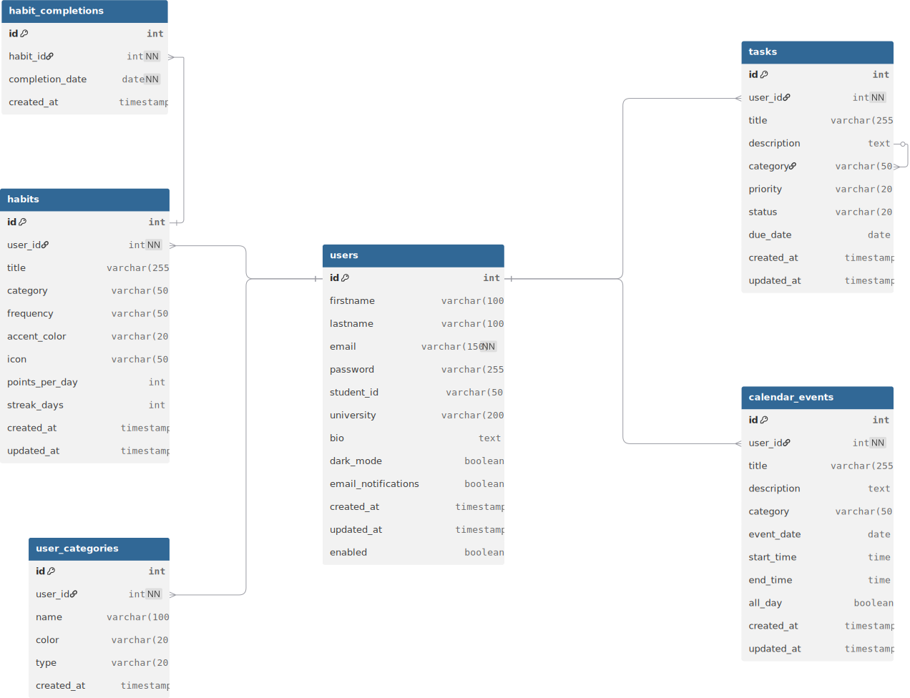
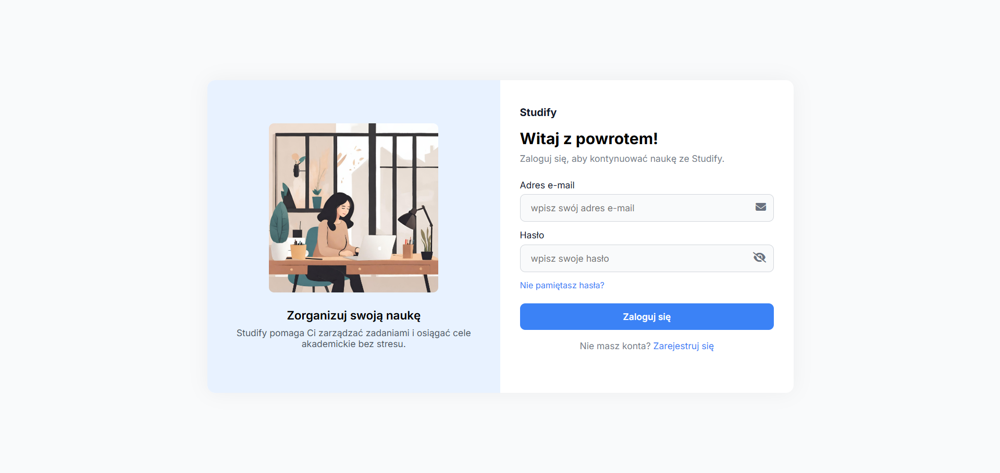
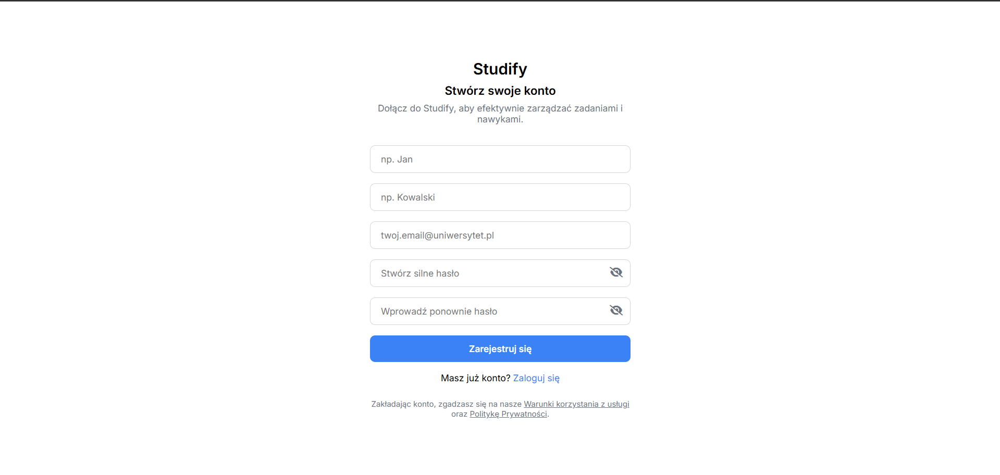
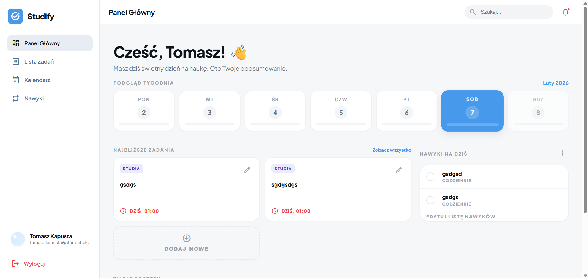
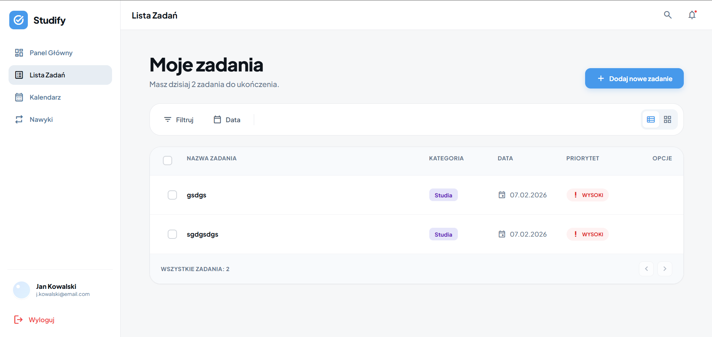
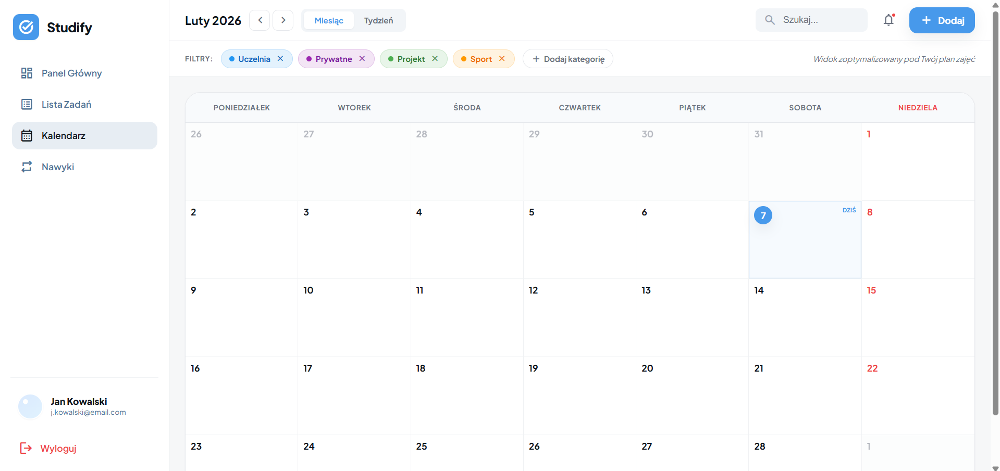
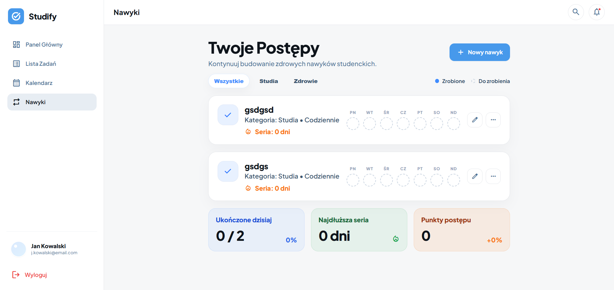
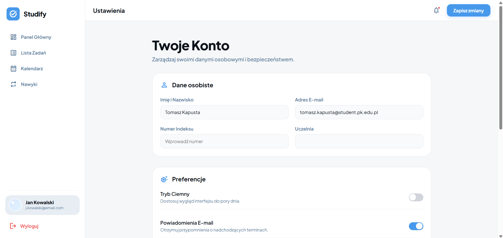

# Studify — Aplikacja do zarządzania czasem dla studentów

> **Repozytorium:** https://github.com/xtomvs/WDPAI



---

## Spis treści
- [Opis projektu](#opis-projektu)
- [Stos technologiczny](#stos-technologiczny)
- [Architektura](#architektura)
- [Baza danych (ERD)](#baza-danych-erd)
- [Ekrany aplikacji](#ekrany-aplikacji)
- [Uruchomienie (Docker)](#uruchomienie-docker)
- [Zmienne środowiskowe](#zmienne-środowiskowe)
- [Scenariusz testowy](#scenariusz-testowy)
- [Checklist funkcjonalności](#checklist-funkcjonalności)

---

## Opis projektu

**Studify** to aplikacja webowa stworzona w PHP, która pomaga studentom w organizacji czasu i zarządzaniu obowiązkami. Aplikacja oferuje:

- **Panel główny (Dashboard)** — widok tygodnia, postępy, nadchodzące zadania i nawyki
- **Lista zadań (Tasks)** — pełny CRUD z filtrowaniem, priorytetami i kategoriami
- **Kalendarz (Calendar)** — widok miesięczny/tygodniowy wydarzeń z kolorami kategorii
- **Nawyki (Habits)** — śledzenie codziennych nawyków z seriami i statystykami
- **Ustawienia (Settings)** — zarządzanie profilem, zmiana hasła

Aplikacja realizuje wymagania projektu WDPAI:
- ✅ Logowanie i rejestracja użytkowników z hashowaniem haseł (bcrypt)
- ✅ Operacje CRUD na zadaniach, nawykach i wydarzeniach
- ✅ Kontrola dostępu — 401 (niezalogowany), 403 (brak uprawnień)
- ✅ API REST z obsługą metod GET, POST, PUT, PATCH, DELETE
- ✅ Responsywny interfejs z sidebar i dynamicznymi widokami

---

## Stos technologiczny

| Warstwa | Technologie |
|---------|-------------|
| **Backend** | PHP 8.x, PDO (PostgreSQL) |
| **Frontend** | HTML5, CSS3 (zmienne CSS), JavaScript ES6+ |
| **Baza danych** | PostgreSQL 15 |
| **Konteneryzacja** | Docker, Docker Compose |
| **Serwer WWW** | Nginx |
| **Narzędzia** | pgAdmin 4 |

---

## Architektura

### Diagram warstwowy

```
┌─────────────────────────────────────────────────────────────┐
│                      KLIENT (Przeglądarka)                  │
│              HTML/CSS/JS • Fetch API • DOM                  │
└─────────────────────────┬───────────────────────────────────┘
                          │ HTTP (GET/POST/PUT/DELETE)
                          ▼
┌─────────────────────────────────────────────────────────────┐
│                      NGINX (Serwer WWW)                     │
│                    Port 8080 → PHP-FPM                      │
└─────────────────────────┬───────────────────────────────────┘
                          │
                          ▼
┌─────────────────────────────────────────────────────────────┐
│                      ROUTING (Routing.php)                  │
│         Statyczne i dynamiczne trasy + API routes          │
└─────────────────────────┬───────────────────────────────────┘
                          │
                          ▼
┌─────────────────────────────────────────────────────────────┐
│                      KONTROLERY                             │
│  ┌─────────────────┐  ┌─────────────────┐                   │
│  │ SecurityController│  │ DashboardController│               │
│  │ TasksController   │  │ HabitsController   │               │
│  │ CalendarController│  │ SettingsController │               │
│  └─────────────────┘  └─────────────────┘                   │
│  ┌─────────────────────────────────────────┐                │
│  │         API Controllers                  │                │
│  │  TaskApi • HabitApi • CalendarApi        │                │
│  │  SettingsApi                             │                │
│  └─────────────────────────────────────────┘                │
└─────────────────────────┬───────────────────────────────────┘
                          │
                          ▼
┌─────────────────────────────────────────────────────────────┐
│                      REPOZYTORIA                            │
│  UserRepository • TaskRepository • HabitRepository          │
│  CalendarEventRepository • CardsRepository                  │
└─────────────────────────┬───────────────────────────────────┘
                          │
                          ▼
┌─────────────────────────────────────────────────────────────┐
│                      MODELE                                 │
│  User • Task • Habit • CalendarEvent                        │
└─────────────────────────┬───────────────────────────────────┘
                          │
                          ▼
┌─────────────────────────────────────────────────────────────┐
│                      DATABASE (Database.php)                │
│                    PDO • PostgreSQL                         │
└─────────────────────────┬───────────────────────────────────┘
                          │
                          ▼
┌─────────────────────────────────────────────────────────────┐
│                      PostgreSQL 15                          │
│              Tabele: users, tasks, habits,                  │
│         habit_completions, calendar_events                  │
└─────────────────────────────────────────────────────────────┘
```

### Struktura katalogów

```
WDPAI/
├── docker/                    # Konfiguracja Docker
│   ├── db/                    # PostgreSQL + init.sql
│   ├── nginx/                 # Nginx config
│   └── php/                   # PHP-FPM Dockerfile
├── public/
│   ├── scripts/               # JavaScript (dashboard.js, tasks.js, ...)
│   ├── styles/                # CSS (layout.css, dashboard.css, ...)
│   └── views/                 # Widoki HTML
├── src/
│   ├── controllers/           # Kontrolery (SecurityController, TaskApiController, ...)
│   ├── models/                # Modele (User, Task, Habit, CalendarEvent)
│   └── repository/            # Repozytoria (UserRepository, TaskRepository, ...)
├── util/                      # Zasoby (screeny, logo)
├── config.php                 # Konfiguracja bazy danych
├── Database.php               # Klasa połączenia z bazą
├── Routing.php                # Router aplikacji
├── docker-compose.yml         # Docker Compose
└── index.php                  # Entry point
```

### Indeksy

| Tabela | Indeks | Cel |
|--------|--------|-----|
| tasks | idx_tasks_user_id | Szybkie filtrowanie zadań użytkownika |
| tasks | idx_tasks_due_date | Sortowanie po terminie |
| tasks | idx_tasks_status | Filtrowanie po statusie |
| habits | idx_habits_user_id | Szybkie filtrowanie nawyków użytkownika |
| habit_completions | idx_habit_completions_habit_id | Szybkie sprawdzanie ukończeń |
| habit_completions | idx_habit_completions_date | Filtrowanie po dacie |
| calendar_events | idx_calendar_events_user_id | Szybkie filtrowanie wydarzeń użytkownika |
| calendar_events | idx_calendar_events_date | Filtrowanie po dacie wydarzenia |

### Widoki i wyzwalacze

W obecnej wersji aplikacja nie wykorzystuje widoków (VIEW) ani wyzwalaczy (TRIGGER) w bazie danych. Logika biznesowa jest realizowana w warstwie PHP (repozytoria i kontrolery).

**Potencjalne rozszerzenia:**
- Widok `v_user_stats` — agregacja statystyk użytkownika (zadania, nawyki, serie)
- Trigger `trg_update_streak` — automatyczna aktualizacja serii nawyku po dodaniu ukończenia

---

## Ekrany aplikacji

### Logowanie


### Rejestracja


### Panel główny (Dashboard)


### Lista zadań


### Kalendarz


### Nawyki


### Ustawienia


---

## Uruchomienie (Docker)

### Wymagania
- Docker Desktop (Windows/Mac) lub Docker Engine + Docker Compose (Linux)
- Git

### Kroki instalacji

1. **Sklonuj repozytorium:**
   ```bash
   git clone https://github.com/xtomvs/WDPAI.git
   cd WDPAI
   ```

2. **Uruchom kontenery Docker:**
   ```bash
   docker-compose up -d
   ```

3. **Poczekaj na inicjalizację bazy danych** (około 30 sekund przy pierwszym uruchomieniu).

4. **Otwórz aplikację w przeglądarce:**
   - Aplikacja: http://localhost:8080
   - pgAdmin: http://localhost:5050

### Domyślne dane logowania

| Usługa | Email / Login | Hasło |
|--------|---------------|-------|
| Aplikacja | j.kowalski@email.com | password |
| pgAdmin | admin@example.com | admin |
| PostgreSQL | docker | docker |

### Zatrzymanie kontenerów

```bash
docker-compose down
```

### Ponowne zbudowanie obrazów (po zmianach w Dockerfile)

```bash
docker-compose up -d --build
```

---

## Zmienne środowiskowe

Konfiguracja bazy danych znajduje się w pliku `config.php`:

```php
<?php
const USERNAME = "docker";    // Użytkownik bazy danych
const PASSWORD = "docker";    // Hasło bazy danych
const HOST = "db";            // Nazwa hosta (nazwa serwisu Docker)
const DATABASE = "db";        // Nazwa bazy danych
```

### Plik `.env.example`

Utwórz plik `.env` na podstawie poniższego szablonu:

```env
# Database
DB_HOST=db
DB_PORT=5432
DB_NAME=db
DB_USER=docker
DB_PASSWORD=docker

# Application
APP_ENV=development
APP_DEBUG=true
APP_URL=http://localhost:8080

# pgAdmin
PGADMIN_EMAIL=admin@example.com
PGADMIN_PASSWORD=admin
```

---

## Scenariusz testowy

### 1. Rejestracja nowego użytkownika

| Krok | Akcja | Oczekiwany rezultat |
|------|-------|---------------------|
| 1 | Otwórz http://localhost:8080 | Przekierowanie na /login |
| 2 | Kliknij "Zarejestruj się" | Formularz rejestracji |
| 3 | Wypełnij: imię, nazwisko, email, hasło | Walidacja pól |
| 4 | Kliknij "Zarejestruj" | Przekierowanie na /dashboard |

### 2. Logowanie

| Krok | Akcja | Oczekiwany rezultat |
|------|-------|---------------------|
| 1 | Otwórz http://localhost:8080/login | Formularz logowania |
| 2 | Wpisz: j.kowalski@email.com / password | Dane testowego użytkownika |
| 3 | Kliknij "Zaloguj się" | Przekierowanie na /dashboard |
| 4 | Wpisz błędne hasło | Komunikat "Nieprawidłowy email lub hasło" |

### 3. Kontrola dostępu (401/403)

| Krok | Akcja | Oczekiwany rezultat |
|------|-------|---------------------|
| 1 | Wyloguj się (lub otwórz nową przeglądarkę prywatną) | Sesja zakończona |
| 2 | Wejdź na http://localhost:8080/dashboard | Przekierowanie na /login (401) |
| 3 | Wyślij GET na /api/tasks bez sesji | JSON: `{"success": false, "message": "Wymagane logowanie"}` |
| 4 | Zaloguj jako user A, spróbuj usunąć zadanie user B | JSON: `{"success": false}` lub 403 |

### 4. CRUD — Zadania

| Krok | Akcja | Oczekiwany rezultat |
|------|-------|---------------------|
| 1 | Przejdź do /tasks | Lista zadań użytkownika |
| 2 | Kliknij "Dodaj nowe zadanie" | Modal z formularzem |
| 3 | Wypełnij: tytuł, opis, kategoria, priorytet, data | Walidacja pól |
| 4 | Kliknij "Zapisz" | Zadanie pojawia się na liście |
| 5 | Kliknij ikonę edycji przy zadaniu | Modal z danymi zadania |
| 6 | Zmień tytuł i zapisz | Zaktualizowane zadanie |
| 7 | Kliknij ikonę usuwania | Potwierdzenie, zadanie usunięte |
| 8 | Zaznacz checkbox zadania | Status zmienia się na "done" |

### 5. CRUD — Nawyki

| Krok | Akcja | Oczekiwany rezultat |
|------|-------|---------------------|
| 1 | Przejdź do /habits | Lista nawyków |
| 2 | Kliknij "Nowy nawyk" | Modal tworzenia |
| 3 | Wypełnij: tytuł, kategoria, częstotliwość | Walidacja |
| 4 | Zapisz | Nawyk na liście |
| 5 | Kliknij nawyk aby oznaczyć jako wykonany | Check animacja, aktualizacja statystyk |
| 6 | Kliknij ponownie | Odznaczenie |

### 6. CRUD — Kalendarz

| Krok | Akcja | Oczekiwany rezultat |
|------|-------|---------------------|
| 1 | Przejdź do /calendar | Widok kalendarza miesięcznego |
| 2 | Kliknij "Dodaj" lub pustą komórkę dnia | Modal dodawania wydarzenia |
| 3 | Wypełnij: tytuł, data, kategoria | Walidacja |
| 4 | Zapisz | Wydarzenie widoczne w kalendarzu |
| 5 | Kliknij wydarzenie | Szczegóły wydarzenia |
| 6 | Usuń wydarzenie | Znika z kalendarza |

### 7. Ustawienia profilu

| Krok | Akcja | Oczekiwany rezultat |
|------|-------|---------------------|
| 1 | Przejdź do /settings | Formularz ustawień |
| 2 | Zmień imię i nazwisko | Pola wypełnione |
| 3 | Kliknij "Zapisz zmiany" | Toast: "Zapisano" |
| 4 | Zmień hasło (stare + nowe) | Walidacja siły hasła |
| 5 | Zapisz | Hasło zaktualizowane |

---

## Checklist funkcjonalności

### Wymagania podstawowe

| Funkcjonalność | Status | Uwagi |
|----------------|--------|-------|
| Rejestracja użytkownika | ✅ Zrobione | Walidacja email, hashowanie bcrypt |
| Logowanie/wylogowanie | ✅ Zrobione | Sesje PHP |
| Kontrola dostępu 401 | ✅ Zrobione | Przekierowanie niezalogowanych |
| Kontrola dostępu 403 | ✅ Zrobione | Użytkownik widzi tylko swoje dane |
| CRUD - Zadania | ✅ Zrobione | Pełny CRUD z API REST |
| CRUD - Nawyki | ✅ Zrobione | Pełny CRUD + toggle completion |
| CRUD - Wydarzenia | ✅ Zrobione | Pełny CRUD kalendarzowy |
| Widoki/wyzwalacze DB | ⚠️ Brak | Logika w PHP |
| Docker Compose | ✅ Zrobione | nginx + php + postgres + pgadmin |

### Funkcjonalności rozszerzone

| Funkcjonalność | Status | Uwagi |
|----------------|--------|-------|
| Dashboard z podsumowaniem | ✅ Zrobione | Widok tygodnia, postępy, zadania, nawyki |
| Filtrowanie zadań | ✅ Zrobione | Po kategorii, priorytecie, statusie |
| Widok listy/siatki | ✅ Zrobione | Toggle w zadaniach |
| Kalendarz miesięczny | ✅ Zrobione | Nawigacja, filtry kategorii |
| Kalendarz tygodniowy | ✅ Zrobione | Toggle widoku |
| Statystyki nawyków | ✅ Zrobione | Serie, punkty, postępy |
| Ustawienia profilu | ✅ Zrobione | Edycja danych, zmiana hasła |
| Responsywny design | ✅ Zrobione | Mobile-first, sidebar |
| API REST | ✅ Zrobione | JSON responses, HTTP methods |

### Dokumentacja

| Element | Status |
|---------|--------|
| README.md | ✅ Zrobione |
| Diagram ERD (ASCII) | ✅ Zrobione |
| Schemat architektury | ✅ Zrobione |
| Screeny aplikacji | ✅ Zrobione |
| Instrukcja uruchomienia | ✅ Zrobione |
| Scenariusz testowy | ✅ Zrobione |
| .env.example | ✅ Opisane |

---

## Autor

Projekt zrealizowany na potrzeby przedmiotu **WDPAI** (Wprowadzenie do Programowania Aplikacji Internetowych).

---

## Licencja

MIT License
